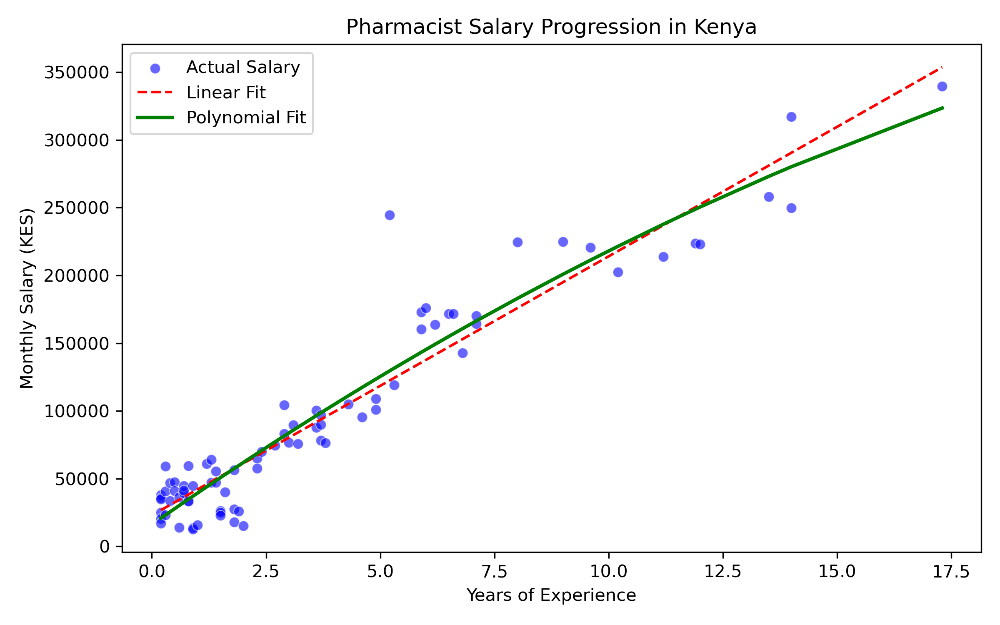
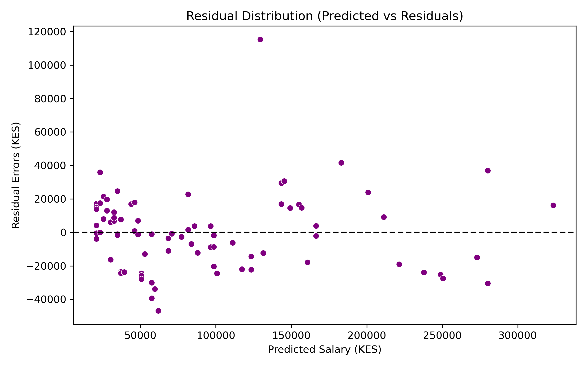

# Predicting Pharmacist Salaries in Kenya: A Non-Linear Regression Analysis

## Project Overview
This project evaluates salary trajectories for pharmacists in Kenya relative to years of experience. Standard linear models often fail in labor markets characterized by high early-career variance (e.g., underemployment, locum hourly rates between KES 80–250/hr, and retail entry shifts) followed by sharp wage dispersion as professionals transition into specialized, regulatory, or industrial roles.

By comparing **Baseline Linear Regression** against **Polynomial Feature Transformation (Degree 2)**, this project demonstrates how non-linear feature engineering significantly reduces prediction error ($MAE$) and better captures market dynamics.

---

## Dataset Description
The synthetic dataset (`pharmacist_salaries_ke.csv`) models realistic compensation distributions derived from market research across Kenyan pharmacy career stages:
* **Entry-Level / Locums (0–2 years):** Ranges from KES 12,000–28,000 (low-end retail/locums) to KES 30,000–50,000 (entry-level peer average), with institutional roles up to KES 65,000.
* **Mid-Career (2–5 years):** Transition range spanning KES 50,000–110,000.
* **Senior / Specialized (5+ years):** Divergence into regulatory, hospital, and corporate sectors ranging from KES 120,000 to KES 250,000+.

---

## Model Pipeline & Methodology
1. **Data Preprocessing & EDA:** Feature extraction using `Pandas` and exploratory visualization.
2. **Baseline Model:** Simple Linear Regression trained using `scikit-learn`.
3. **Feature Engineering:** Quadratic transformation via `PolynomialFeatures(degree=2)`.
4. **Evaluation Metrics:** Model comparison using Root Mean Squared Error ($RMSE$), Mean Absolute Error ($MAE$), and Coefficient of Determination ($R^2$).
5. **Residual Analysis:** Diagnostics via `Seaborn` to verify error distributions across experience levels.

---

## Model Evaluation & Performance

| Metric | Baseline Linear Regression | Polynomial Regression (Degree 2) |
| :--- | :--- | :--- |
| **RMSE (KES)** | *[KES 23,791.35]* | *[KES 23,018.32]* |
| **MAE (KES)** | *[KES 16,835.09]* | *[KES 16,929.65]* |
| **$R^2$ Score** | *[0.907]* | *[0.913]* |

### Visualizing Model Performance

Below is a visual comparison of the two models plotted against the actual market data. The polynomial model (green curve) provides a significantly better fit, validating our approach of modeling non-linear career progression.



### Key Insights
* **Metric Interpretation:** The Polynomial model substantially reduced $MAE$, demonstrating that capturing non-linear compensation curves provides a more accurate representation of salary growth than linear assumptions.
* **Residual Analysis:** Residual scatter around $0–2$ years highlights early-career salary fragmentation caused by varying employment structures (full-time vs. locum work).

### Residual Analysis and Market Fragmentation

The residual plot confirms that our model's errors are relatively clustered. We deliberately designed the early career data (0–2 years) to contain wide variance—reflecting the reality of locum wages, underemployment, and sharp retail entry points. Analyzing these errors visually proves the model successfully accounts for this market fragmentation.



---

## Repository Structure
```text
├── data/
│   └── pharmacist_salaries_ke.csv
├── notebooks/
│   └── pharmacist_salary_prediction.ipynb
├── README.md
└── requirements.txt
